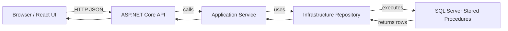

# Spinrise Architecture Guide

## 1. What this project is

Spinrise is an ERP migration project. It moves an old VB6 system into a modern web app.

- Backend: ASP.NET Core 8
- Frontend: React 18 + TypeScript
- Database: SQL Server with stored procedures
- Data access: Dapper (no Entity Framework)

## 2. What is in the project

### Main folders

- `backend/Spinrise.API/`: the backend web server
- `backend/Spinrise.Application/`: service logic, DTOs, and interfaces
- `backend/Spinrise.Infrastructure/`: database access with Dapper
- `backend/Spinrise.Domain/`: core business entities
- `backend/Spinrise.Shared/`: shared constants and models
- `backend/Spinrise.DBScripts/`: SQL tables, stored procedures, and scripts
- `frontend/spinrise-web/`: React frontend app
- `AI_Reference/`: guides for AI-assisted work
- `project-docs/`: project documentation like this architecture guide

### Important files

- `backend/PROJECT_GUIDE.md`: the backend coding and architecture rules
- `DEVELOPMENT_WORKFLOW_GUIDE.md`: step-by-step work process
- `AI_CONTEXT.md`: short project summary for AI helpers
- `sql_to_storedprocedure_guide.md`: how to move VB SQL into stored procedures
- `backend/PR_Backend_Migration_Guide.md`: purchase requisition migration plan
- `frontend/spinrise-web/package.json`: frontend tools and scripts

## 3. How the backend works

The backend is built in layers.

### Layers in simple words

1. **API layer**: receives requests from the browser
2. **Application layer**: decides what the app should do
3. **Infrastructure layer**: talks to the database
4. **Domain layer**: keeps the main business ideas

### Easy formula

`Controller -> Service -> Repository -> Stored Procedure -> SQL Server`

That means:

- the browser asks the controller
- the controller asks the service
- the service asks the repository
- the repository calls a stored procedure in SQL Server
- SQL Server sends data back

### Why this is good

- The code is clean and easy to understand
- Database rules stay in one place (stored procedures)
- We avoid building SQL using string glue, which is unsafe
- We can test backend logic step by step

### Architecture diagram

## 4. How the frontend works

The frontend is a React app.

### Main ideas

- Uses **React 18** and **TypeScript**
- Uses **Vite** to build and run the app
- Uses **Ant Design** for UI components
- Uses **Zustand** for state (app memory)
- Uses **Axios** to call backend APIs

### How a page works

1. User opens a page in browser
2. React shows the page and places buttons and forms
3. If the page needs data, it calls the backend API
4. Backend returns data as JSON
5. React shows data on the page
6. If user saves data, React sends it back to the backend

### API types

The app can generate TypeScript types from the backend API using `orval`.
That keeps frontend and backend talking with the same data shapes.

## 5. What to do when using AI each time

Use AI helpers every session, but follow the rules.

### AI session checklist

- open `AI_CONTEXT.md` first
- open `backend/PROJECT_GUIDE.md` and `DEVELOPMENT_WORKFLOW_GUIDE.md`
- tell AI: this is a Spinrise ERP migration project
- ask AI to follow the layered backend pattern and stored procedure rule
- ask AI to follow the React frontend feature structure
- check AI output before using it
- always run tests after AI writes code

### Good AI instructions

Use words like:

- "Follow the Spinrise backend pattern: Controller -> Service -> Repository -> Stored Procedure"
- "Use Dapper and parameterized stored procedures only"
- "Create the React feature in `src/features/<Module>/`"
- "Use Ant Design components and Zustand state"

### What not to do

- do not let AI write raw SQL string building in C#
- do not let AI bypass stored procedures
- do not change the core folder structure without approval
- do not ignore the `User` module pattern

## 5.1 Commenting and documentation rules

- Backend methods should include short comments for business rules, validation checks, and stored procedure intent.
- Use XML summary comments on public controller, service, and repository methods.
- Frontend components should document props, hook responsibilities, and API call purpose.
- Keep comments simple and helpful: explain why, not what.
- Add README or comment block at the top of each new feature folder and page.

## 6. Project workflow for new work

### Step 1: Understand the current task

- Read the migration guide and existing code
- Find the VB6 source or the old feature requirements
- Find the existing module that is most similar

### Step 2: Check the database first

- Look at `backend/Spinrise.DBScripts/01 Tables/`
- Look at `backend/Spinrise.DBScripts/02 Stored Procedures/`
- Confirm the tables and stored procedures exist
- Use a local development SQL Server if possible

### Step 3: Build the backend first

- Add or update stored procedures in SQL Server
- Add the repository method in `Spinrise.Infrastructure`
- Add the service method in `Spinrise.Application`
- Add the controller endpoint in `Spinrise.API`
- Keep the API response format consistent

### Step 4: Build the frontend next

- Add a feature folder in `frontend/spinrise-web/src/features/`
- Add page components, hooks, and API calls
- Generate API types with `npm run generate:api`
- Connect the page to the backend API

### Step 5: Test everything

- Run the backend locally with `dotnet run --project Spinrise.API`
- Run the frontend locally with `npm run dev`
- Check the feature in the browser
- Run unit tests and any available integration tests

## 7. Improvements for the project

### Quick wins

- Add a simple architecture diagram to this file (done)
- Add short XML-style comments to backend controllers, services, and repositories
- Add a small frontend folder structure README in `frontend/spinrise-web/README.md`
- Add test stubs for backend services and frontend pages, then implement them

### Better habits

- keep frontend components small and reusable
- keep stored procedures named clearly like `usp_<Module>_<Action>` 
- keep backend code in the same pattern as the `User` module
- keep database scripts under `backend/Spinrise.DBScripts/`

### Future improvements

- add end-to-end tests from browser to database
- add CI checks for lint and backend tests
- add a migration tracking list for VB6 features
- add a shared glossary of terms for ERP features

## 8. Comments for the team

- This is a migration project, not a rewrite from scratch.
- Keep the old VB6 logic in mind, but do not copy its bad patterns.
- Use this guide as the first rule book for new work.
- When in doubt, compare with the `User` module pattern.
- Every session with AI should start by reading the project guides.

## 9. Bottom line

Spinrise is an ERP migration from VB6 to ASP.NET Core + React.
Follow these rules:

- backend in layers
- data access through stored procedures
- frontend by feature modules
- use AI as helper, not the final author
- keep the project easy to understand
